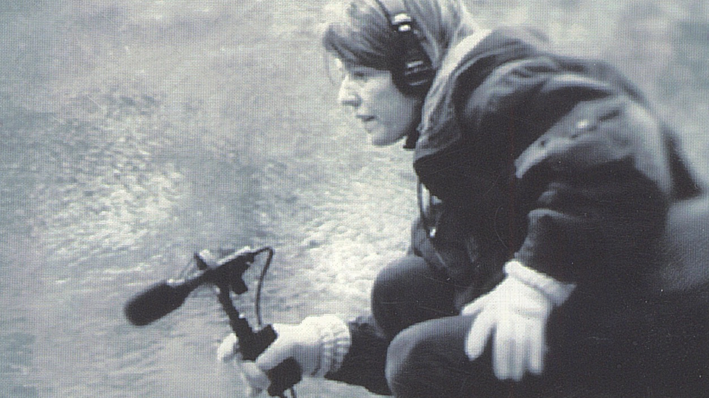
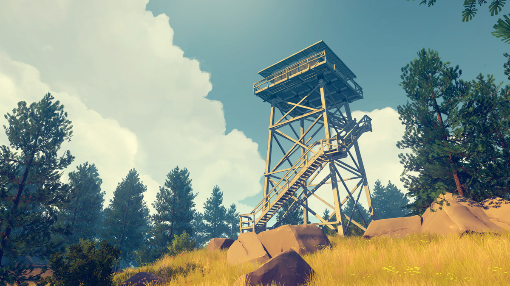
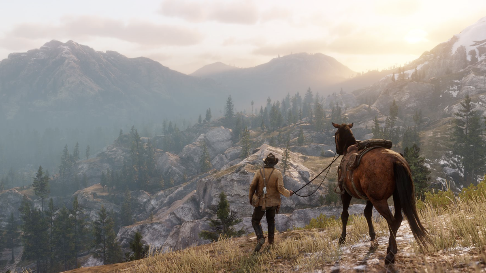
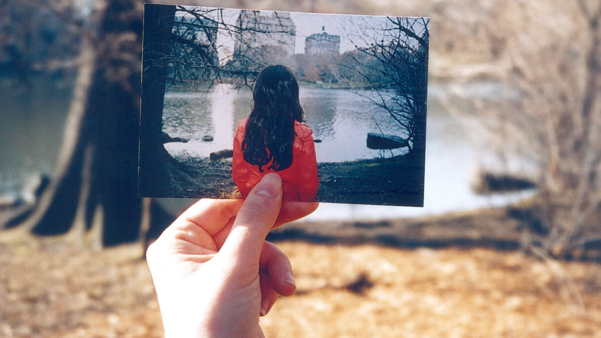
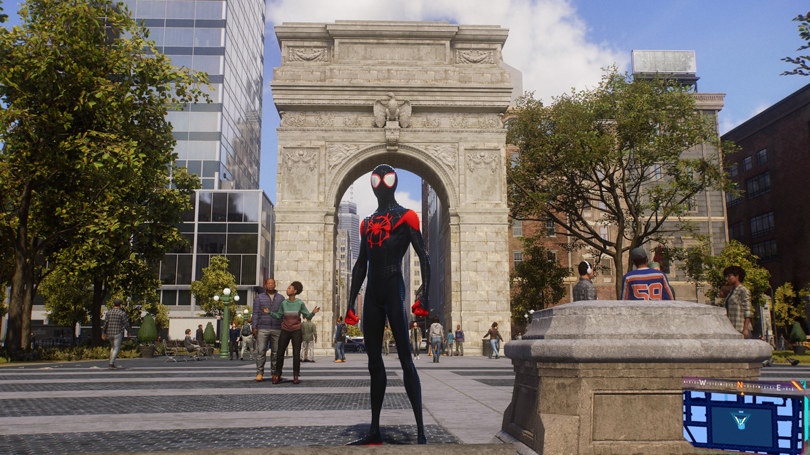
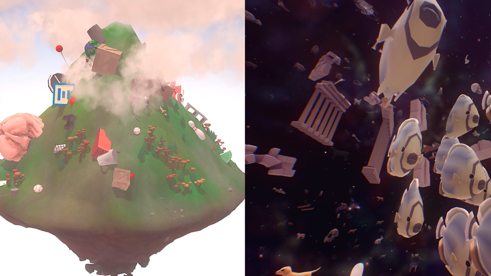
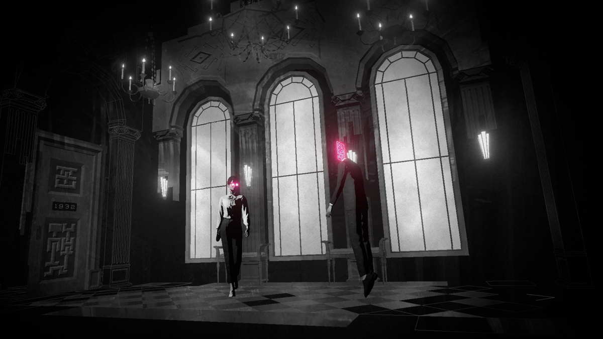
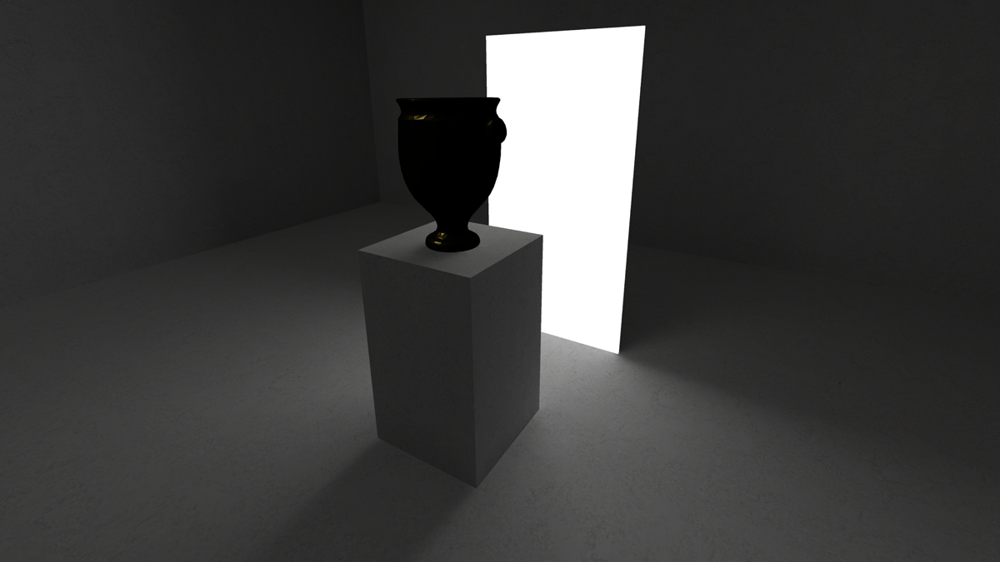
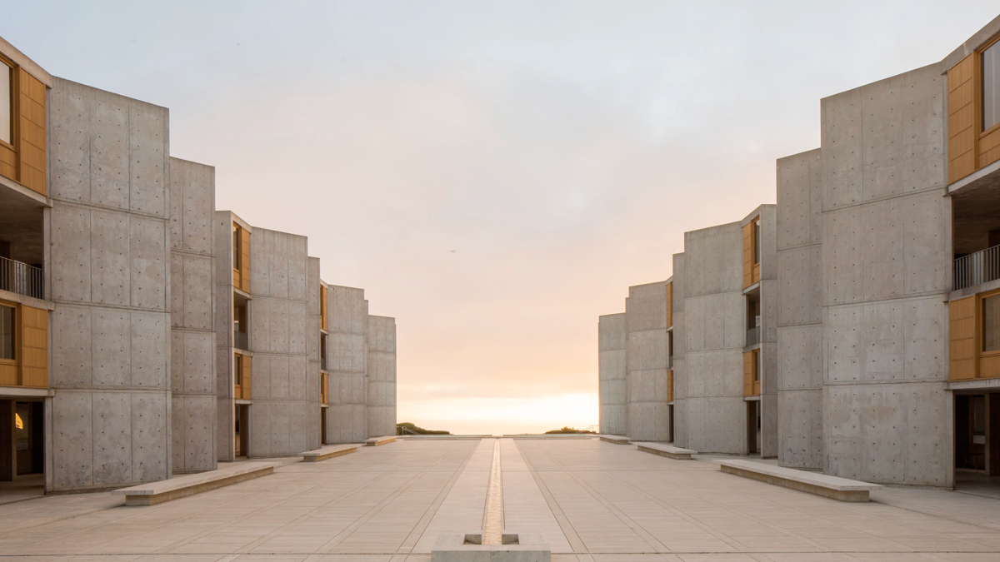
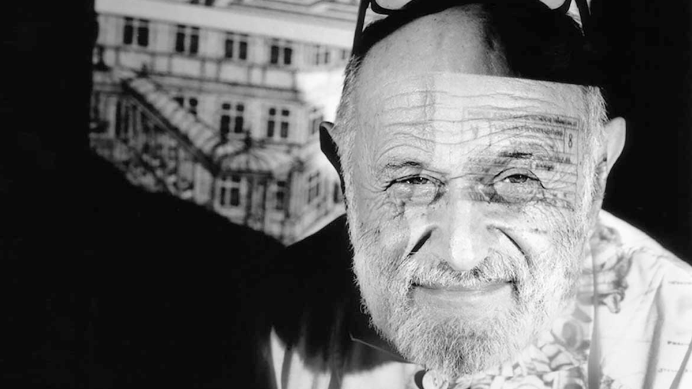

# Question 3

_What are the current and historical approaches to the use of sound in the context of contemplation, with a particular focus on games? Please outline your process and results with respect to research-recreation responses to this subject area._

## A Survey of Contemplative Aesthetic Practices

Throughout this study, a significant goal was to examine how other fields approached the potentiality of contemplation. While not a widespread stated outcome of many practices, quite a few can teach us about these contemplative, reflective, and more profound experiences with our designed world. The lessons and ideas I took from this study were then applied to a series of experiments to explore how to design sound games for contemplative experiences. Finally, after presenting and discussing these precedents and the experimental games that resulted, I have begun the first steps of articulating a framework for the aesthetics of contemplative games which I will outline at the end of this study.

### Soundwalks

#### Westerkamp

One field of practice that can significantly inform this concept of contemplative games is Soundwalking. Soundwalking started as part of R. Murray Schafer's *World Soundscape Project*, which arose from active listening practices developed by artists like John Cage and Pauline Oliveras. Schafer and those in the project sought to anchor these active listening practices to a given place. Hildegard Westerkamp especially believed that through soundwalking, listeners could better understand their sonic environments. 

_A soundwalk is any excursion whose main purpose is listening to the environment. It exposes our ears to every sound around us, no matter where we are. We may be at home, we may be walking across a downtown street, through a park, along the beach; we may be sitting in a doctor's office, in a hotel lobby, in a bank; we may be shopping in a supermarket, a department store, or a Chinese grocery store; we may be standing at the airport, the train station, the bus-stop. Wherever we go, we will give our ears priority. They have been neglected by us for a long time and, as a result, we have done little to develop an acoustic environment of good quality._[^2]

Additionally, Westerkamp recorded soundwalks so that those who could not actually visit a given location could experience it remotely. Westerkamp then broadcasted these recordings on her radio program on Vancouver Co-op Radio, sometimes commenting on what the listener was hearing. These guided soundwalks were a way to point out to the listener things that they otherwise might have missed.

#### Experiments S.1 & S.2

In response to this Westerkampian style of Soundwalk, I created a series of recorded audio essays over videogame footage. In these experiments, I pointed out sonic elements from the game, directing the listener's attention to how these worked in the game and maybe giving technological background for how these sounds might function on a sound design level. 

_What does it even mean to listen to our games? There is sound there, to be sure, but do we pay attention to it? What do you hear right now as you play? What time of day is it, and how are the sounds communicating that to you? Are you in a bustling part of the financial district at mid-morning with citizens congratulating you on your most recent exploits? Are you in a more isolated part of the city in the late evening? Maybe Central Park with small scurrying animals and the wind whistling through the trees._[^3]

One revelation from this process is realizing how the material edges blur when we are talking about "soundwalking" in games. In the physical world, we are pointing to real sonic phenomena out in the world, whether that is from natural or manmade sources (the way the wind whistles through a tree's leaves, the sound that a bridge makes when you rap it with your fists). But in games, we are expounding upon the sonic qualities of digitally replicated sounds, which have been designed a certain way and added to the space for a given reason. In this way, we can argue that one of the underlying "natural" aspects of this sonic environment is its technology. Thinking about this technology (and the associated design, social, and economic systems around it) as a material aspect of the soundscape opens up some exciting possibilities for future consideration.
#### Janet Cardiff and George Bures Miller

The Soundwalks of Janet Cardiff and George Bures Miller differ from Westerkamp's in a few ways. While they are similar to Westerkamps in-person guided listening walks in that they take place in a given sonic environment that the listener is currently in, neither Cardiff nor Miller are actually present. Instead, Cardiff's pre-recorded voice guides the listener via headphones. Cardiff/Miller leverage this recorded to technology to then overlay audio in exploratory and exciting ways. Snippets of conversation slip by that feel like they are in the same space as you. Cardiff speaks directly to you but then has a conversation with others who are not visibly present. Recorded audio effects of long-gone marching bands, sirens, and political rallies make the listener feel like they are experiencing a highly professional radio drama. 

From Cardiff/Miller, I identified six strategies for creating profound experiences with soundwalks.

- *Synchronization* - Creating a sense of rhythm and focus by asking the participant to align physical actions to the audio (breathing, walking, looking)
- *Frame-Shifting* - Indirectly encouraging active listening by juxtaposing and overlaying incongruous and/or complex sounds
- *Parallel Realities* - Layering 3D sounds and effects that blur the listener's perception of recorded and live space
- *Alternative Scoring* - Overlaying musical combinations on an existing space
- *Historical Narratives* - Presenting stories and other history-telling forms relating to the current space inhabited by the listener
- *Personal Narratives* - Incorporating personal speech from a narrator,  including environmental sounds local to the narrator, often set in the same space the listener is in

#### Experiments S.3-S.9

Taking inspiration from Cardiff/Miller and their soundwalks, I created a series of soundwalks that each focused on one of the strategies listed above. This exploration led to the publication of the paper [Experiments in Soundwalks for Video Games](https://www.cmmas.com/en/ideassonicas32/ideassonicas%2Fsonicideas-23) for the 23rd issue of [Sonic Ideas](https://www.cmmas.com/en/sonicideas).

One of the main takeaways from working on this series of experiments is how the medium of video games is a compelling space for thinking about what it means to be in the same space. If you and I are both playing _Spiderman 2_ we are clearly both in a fictional version of New York City, but there is also the possibility that I am in your living room/bedroom and you are in mine. Do the sounds of my controller, children, and physical space bleed into yours? Does this widen the soundscape into more complicated territory? 

### Ambient Interactive Experiences

Another collection of works that I considered as a reference point for contemplative sound games is what I initially called "slow games" but am now referring to as "ambient interactive experiences." The field of slow games is compelling and a clear precedent (with Liam Gibbons's thesis "Strategies for the Design of Reflective Shortform Videogames" from 2020 being especially instructive as I work on these ideas), but thinking about ambient media opens up the opportunity to include a lot more material.[^4] These projects all appear to be interested in slow pacing, obfuscation, and less "comfortable" experiences, with varying degrees of success.

#### Luke Jaaniste

Luke Jaaniste's thesis "Approaching the Ambient: Creative Practice and the Ambient Mode of Being" from 2007 seems like a good place to start when defining what we mean by ambient experiences. Interestingly enough, Jaaniste's proposal of the "ambient mode" is a bit counter to what we might think of as an ambient experience:

_The ambient mode involves engaging with our surroundings as an ambient pervasive all-around field, without anything being prioritised into foreground and background. Without the salience of the foreground, what would need to become salient is the pervasive ambience itself._

This is in opposition, in particular, to Brian Eno's concept of the ambient as being something that can move from foreground to background in the mindful attention of the audience. Eno's concept is more aligned with the use of Gestalt theory in traditional visual design fields.

#### David Oreilly

David Oreilly's two pieces [Mountain](https://store.steampowered.com/app/313340/Mountain/) and [Everything](https://store.steampowered.com/app/582270/Everything/) are great examples of this difference between pervasive ambient experiences versus the Eno-ish mode that Jaaniste refers to as the ambivalent (back-and-forth) mode. In Mountain, almost nothing is required of the player. They need to set the simulation in motion, but after that has happened, there is not much for them to do. Rotate the mountain. Zoom in. Zoom out. The mountain sits there and mountains. The user can reflect on the mountain or tune it out while focusing on other things in their life. In contrast, Everything requires more of the player, asking that they work their way through the staggering number of 3D models that Oreilly has created. Oreilly included an auto-play mode, but even with this it still seems to portray a much more focused "pervasive" ambience.
#### ABZU

On the surface, the 2016 game ABZU appears to be a perfect example of an ambient game. The player swims freely in deep ocean waters while rich orchestral music plays. However, it opposes all of the ideas in Rilla Khaled's "Questions Over Answers: Reflective Game Design."

- The simple puzzles have single answers -- though perhaps the narrative raises questions (Answers OVER Questions)
- It seems to focus on more of a stealth method of infusing values (Stealth OVER Clarity)
- The whole thing is a comfortable experience (Comfort OVER Disruption)
- It is very immersive (Immersion OVER Reflection)

#### Lorelei and the Laser Eyes

In contrast to ABZU, Simogo's [Lorelei and the Laser Eyes](https://simogo.com/work/loreleiandthelasereyes/) feels like a much more traditional puzzle game, but a lot of the narrative content is intentionally ambiguous, possibly leading to more reflective experiences. The game isn't inherently ambient at all, but some of the difficult puzzles mean that the player might be living with the game in the background of their mind for the days or weeks in which they are playing the game. They might be focusing on something at work, and then suddenly, a possible solution to a puzzle that previously stumped them can float to the forefront of their mind. Additionally, it's interesting to think here about the place of puzzles as potential roadblocks. If these puzzles create disruption, *can* they lead to reflection? And if they do, is it the right kind of "reflection?"

#### v r 5

Pippin Barr's [v r 5](https://pippinbarr.com/v-r-5/info/) might be the most successful ambient game experience that I looked at because it is trying (at least in part) to recreate a type of museum-going experience that is inherently experiential. As viewers approach an artwork, they bring it to the foreground of their mind, but as they wak away that memory of the artwork pervades and informs future observations. Additionally, standing in front of an artwork, the viewer can stay in that space, that specific pervasive ambience, for as long as is desired. Most games don't afford this. Those that include cinematic cut-scene experiences allow for the player to skip them. It would be almost forbidden to ask players to sit still and experience a thing without letting them pound on the buttons. 

#### Experiment R.1

In response to these ambient games, I created contemplative game experiences built on the ideas of pervasive ambience.

This first experiment ([R1](https://mouseandthebillionaire.com/reflectiveStudies/01/)) explored simple constant interaction from the user. When they hover over the black circle, it slowly grows in size while the audio detunes and becomes more complex.

One interesting thing about this is that the act of holding the mouse over the circle becomes easier and easier as the circle grows larger (until the user doesn't need to do anything for it to continue). This feels in line with reflective or meditative experiences. It's often more challenging to get going and decide to take time away from your thoughts or activities, but once you're going, it's much easier to keep going. There's just enough effort required of you from the start, which is satisfying as those requirements become less and less.

#### Experiment R.2

This second iteration ([R2](https://mouseandthebillionaire.com/reflectiveStudies/02/)) is functionally the same as R1 but inverts the colors and has the music progressing from distortion to clean, thus creating a bit more thematically aligned experience.

#### Experiment R.3

In this experiment ([R3](https://mouseandthebillionaire.com/reflectiveStudies/03/)), the user is presented with a randomized looping pattern of airy piano notes against a droning background. They can use WASD to "wander," which randomizes the notes and creates a flurry of static and jittering radio notes. Once they stop, a new pattern emerges, and they can choose to sit with it for as long as they desire or continue wandering in search of something new. The goal of this experiment is to see what is available when thinking about trying to push the player toward inactivity. Is it possible to make an engaging experience when you are asking the player *not* to play?

#### Experiment R.3.5

[Experiment R.3.5](https://mouseandthebillionaire.com/reflectiveStudies/03/dontSnake.html) took the ideas from R3 and applied them to the game Snake. If the player tries to use the keyboard to move their snake, a chaos of notes and shapes issues forth. Adding this playable layer to the previous experiment creates a tension between wanting to act (snake) and not. By deciding to let the snake wrap around the sides, it becomes possible for the player to really stop playing and pay attention to the sonic patterns created as their snake slowly and repeatedly traverses the playing field.

### Experimental Ideas

The final grouping of projects for precedents on contemplative game experiences is a loose collection of what I have defined as "experimental ideas." These ideas cover a wide selection of fields but are united in that the material aspects of the art forms directly inform the design of the contemplative experience.

#### Performative Objects

In her essay "Designing Mindful Interaction: The Category of Performative Object," Kristina Niedderer lays the framework for her concept of "performative objects." It is notable that she separates these performative objects from art objects.

_"For example, the display of a half-full water glass on a shelf would not draw anyone's attention if it were in a kitchen. But if the same glass is called "An Oak Tree" and/or displayed in the context of an (art) gallery, we allow time to notice the glass and its meaning. Mindfulness, therefore, can be created through the institutional context of art, which is "a certain set of coordinated social practices." However, the concern here is with objects that can cause mindfulness in the context of everyday use, and not in the institutional context of art"_[^5]

This separation means that the performative object must rely on adaptations within its formal elements to create a contemplative state *while remaining functional.* Thus, Jacques Carelman's _Catalogue d'Objets Introuvables_ may not fit this description since they are inherently unusable objects.[^6] This is particularly interesting as we consider designing contemplative experiences for game-like experiments that retain their sense of play.

#### Contemplative Architecture

Djebbara et al.'s "Contemplative neuroaesthetics and architecture: A sensorimotor exploration" provided many helpful language and concepts for framing contemplative experiences outside religious and/or spiritual settings. The distinction between contemplation and "mindfulness" is beneficial:

_"we define mindfulness as a state of non-judgmental awareness and focused attention on the present moment, while contemplation as a state of intense concentration, introspection, and open or directed consideration "_[^7]

The phrases' introspection' and 'open consideration' lend a more open-ended, less goal-oriented approach than the word "reflection" is often used in the design literature. Additionally, their separation of externally-induced (EX-I) and internally-induced (IN-I) means of reaching contemplative states is helpful. Likewise, it is interesting to note that architects (as *functional* aesthetic practitioners) value architecture as a means to contemplation because of the "performative" success of the values within. All of this seems to align with at least some of how we think about video games, which are also "functionally" aesthetic objects. 

#### Vilém Flusser

Lastly, the essay collection "Immaterialism" by Vilém Flusser was influential as I thought about how practitioners can experiment with the formal elements of their craft. In this collection, the artist Chagrin creates rhythmic patterns out of Flusser's words, using typography to add and strengthen external meaning outside of the meaning present in the spoken word. 

#### Experiment R.4

In [experiment R.4](https://mouseandthebillionaire.com/reflectiveStudies/04/), I built a progressive text experiment influenced by Flusser's "Immaterialism." Patterned text objects appear as the user clicks the screen, accompanied by music, and progress from more experimental sections to sections taken from the original text.

Initially, I planned to use a text from one of the stoic philosophers. However, after reflecting on the use of monospaced font (and the nature of textual representation on screens vs. print), I thought that Walter Benjamin's essay "The Work of Art in the Age of Mechanical Reproduction" would be a successful alternative. The final implementation is reasonably successful, with the time-based aspect of interactive screen-based works fitting in well with the thematic content and adding to Benjamin's ideas of technological art forms adopting and then going beyond the constraints of their predecessors. 

## Aesthetics for Contemplative Audio Games

Book III of Schopenhauer's "The World as Will and Representation" holds some interesting language about what he calls "aesthetic contemplation," which is pertinent to the ideas of contemplation in artistic fields. In section 34, he describes the shift from looking at something through "reason" to "a steady contemplation" by saying:

"_if, instead of all this, we devote the entire power of our mind to intuition and immerse ourselves in this entirely, letting the whole of consciousness be filled with peaceful contemplation of the natural object that is directly present, a landscape, a tree, a cliff, a building, or whatever it might be, and, according to a suggestive figure of speech, we *lose* ourselves in this object completely, i.e we forget our individuality, our will, and continue to exist only as pure subject, the clear mirror of the object_"

Schopenhauer argues that this shift helps to bring the viewer closer to the "Idea" rather than the object, echoing Plato's notion of an ideal form. While we don't necessarily need to carry over this idea of an idealized form (or spiritual/essential perfection), this concept of aesthetic contemplation helps discuss the type of experience that one could have with the built world, an experience that moves from the surface to something deeper. What is especially helpful is how Schopenhauer includes space for *active* contemplation on the viewer's part. It is not a passive, peaceful, zen calm, but rather an attitude of looking that is searching for more. Some philosophers and art historians have coined the term ["aesthetic attitude"](https://iep.utm.edu/aesthetic-attitude/) to explain this idea. 

Reflecting on the above survey, I began thinking about how it is possible for us to think about the foundational elements of certain objects as the gateways from which a reflective/contemplative experience might stem. For example, is the contemplative nature of architecture embedded in the way that light hits specific colors? Or how light and sound reverberate together in a particular room? With a particular shape? And of a particular material? If this is the case, what are the material elements of other media that can be examples of contemplative art? Light and hue for painting. Timbre, frequency, and reverberation for audio. 

After examining these fields and experimenting with how those lessons could be applied to sound games, a question became apparent. Is it better for designers to engage with the materiality of games, the things that make games games, instead of mimicking those aspects of contemplative experiences that we can only recreate digitally? Rather than approach the inherently thingy-ness of digital technology, we continue to rely on metaphors and ideas borrowed from existing areas of life. What are the things of digital technology or of games (the stuff games are made of) that we can build these contemplative experiences out of?

As an exploration, how could we highlight and group aesthetic materials of games to be used for lenses/methods/areas of contemplative engagement? The above study shows that related fields can teach us much about these foundational elements. Aesthetic architecture, for instance, could inform contemplative applications in the concept of the "magic circle;" Ambient interactive experiences help us to think about how games (and audio) rely on the perception of time, and Soundwalks could be informative about the spatial aspects of games and how the human body relates to that digital space. This is a messy, incomplete, and fractured start, but I believe there is potential for some exciting conversation about achieving aesthetic contemplation in gameplay experiences.[^8]

[^2]: **Westerkamp, “Soundwalking,” [https://www.hildegardwesterkamp.ca/writings/writingsby/?post_id=13&title=soundwalking](https://www.hildegardwesterkamp.ca/writings/writingsby/?post_id=13&title=soundwalking)**
[^3]: Bethancourt, guided soundwalk for Firewatch and Red Dead Redemption 2
[^4]: In particular, the possibility to think about Eno's ambient work (obviously) and also Paul Roquet's [Ambient Media](https://www.upress.umn.edu/9780816692460/ambient-media/), which I haven't referenced at all in this study but think about a great deal
[^5]: Niedderer, "Designing Mindful Interaction: The Category of Performative Object"
[^6]: the *Coffeepot for Masochists* from the cover of Don Norman's "The Design of Everyday Things" is possibly the most famous example of this
[^7]: Djebarra et al., "Contemplative neuroaesthetics and architecture: A sensorimotor exploration" 
[^8]: Side note: I am realizing that all of these could possibly be framed with Soundwalks as the connecting tissue, in which case the format might be more of: element A is in games, here is how that is handled in Soundwalks, here is how it is handled in other disciplines, here is a series of experiments I made in reaction to this

