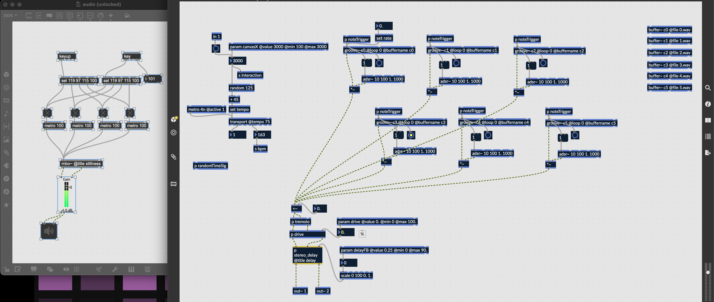
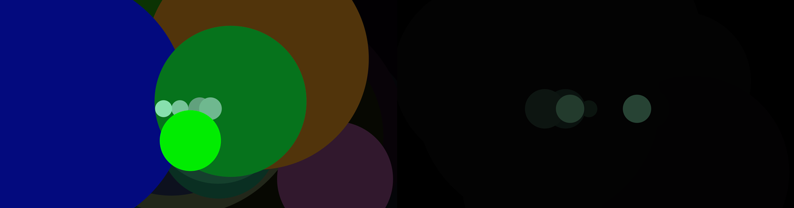
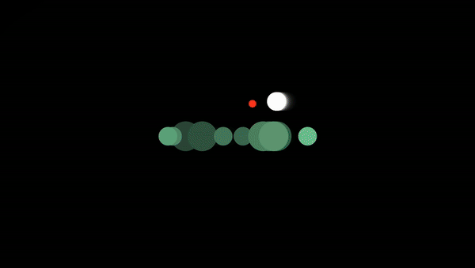

# Experiments and Responses

A series of small experiments for reflection in games, primarily focusing on experimental interactions in p5.js and sound design in RNBO.

## Experiment 1 // 19 Jun, 2024

It's a black circle. Touch it.

https://mouseandthebillionaire.com/reflectiveStudies/01/

When the user hovers over the black circle it begins to slowly grow in size while the audio detunes and becomes more complex.

One interesting thing about this is that the act of holding the mouse over the circle becomes easier and easier and easier as the circle grows larger (until really the user doesn't need to do anything for it to continue). This feels in line with reflective or meditative experiences. It's often harder to get going, to decide to take time away from your thoughts or activities but then once you're going it's much easier to keep going. From my perspective the act of holding the mouse on the circle does bring about a bit of a calming experience (which, it's still to be determined wether or not \[probably not\] 'calming' is even a goal) But also, this feels focusing. There's just enough effort required of you from the start, and it is satisfying as those requirements become less and less.

Sonically, the sounds become lower and slower as the mouseover interaction progresses, which feels right. Additionally, there is a distortion *added*, and while this may initially feel like a weird decision, I think it works in a [Low "Hey What"](https://lowtheband.bandcamp.com/album/hey-what) kind of way (which, I feel is very soothing/reflective, but maybe not to all)

## Experiment 2 // 27 Jun, 2024

A white circle grows in...

https://mouseandthebillionaire.com/reflectiveStudies/02/

How did a week go by and I'm only *now* doing this? Focusing on reading? "Living" with the last prototype? Lazy? Either way, yeesh.

After trying the first version, LLB suggested moving from atonal/distortion to tonal/clean and we thought a simple flip of the black/white would mirror that change. As much as I hate to admit, I think it does work better? Even without changing the base audio, there is something about moving *out* of the distortion that communicates "improvement."  

Some ideas arise for a third iteration or for implementation in new prototypes:

- PJB suggested non black/white as more interesting, which is a good idea as it also gets us away from the good/bad language but I do kind of like the blank canvas aspects of B/W. 
- I'd like this to get a little more character at some point (hand-drawn, sketchy, tikatmos/lthc-vibe) but I don't want to get bogged down in needing to stylize the whole thing. Hopefully have this happen organically as the thing evolves. That being said, I think the first step might be to swap out this ugly start button...
- I don't mind sitting with this playing for a while, but I might have a higher tolerance to microchanges in music than the common listener, so it is probably a good idea to add a second (third? fourth? fifth?) stage of musical movement and/or slightly more interesting changes. However, the visuals don't do anything once the circle fils the screen, so maybe that doesn't make sense? But maybe they could?
- Adding on to this, I had it playing in the background as I was writing up the journal entry and at some point it refreshed to the start screen. I don't know if this was a p5 thing, or the localhost freaked out, but it brings up the problem of letting the thing grow and grow and grow which is unnecessary (and lazy) so should be addressed in any further iterations.
- For this version both the chimes and the chords are tuning as the interaction progresses, but it sound effective to have them retune at different speeds or have the chimes start in the root tone, causing them to move in out of phase/tune as the circle fills the screen.
- Side note: the number of times that I am typing too fast and swap the "ion" to "ino" in words (i.e distortion to distortino) is getting silly. The best way to acknowledge this fault in my typing skills is probably to have a project called something like EXPERIMENTINO)

## Thoughts on Future Possible Experiments // 17 Jul, 2024

- A version based on movement vs. no-movement where when you move there is chaos and when you don't it's in stasis. This "movement" could be with the mouse, arrow keys, an actual character in 2D/3D space? Chaos could be explosions of colors and shapes with stasis being simple repeated shapes (a la Bloom)
- Sonically, the chaos could be a constant cycling of possible note patterns in RNBO with stasis being a set pattern for some number of instruments. Or as you move it randomly plays pitches, but when you stop it settles on a specific pitch for each instrument. Or as you move it randomizes between voices, creating cacophony, but when you stop it chooses one. Or some combination of all of this.
- Reading Koike's [Practice of Not Thinking](relatedWork/#Koike, R. *The Practice of Not Thinking: A Guide to Mindful Living*), makes me think there could be some version of this that feels more game-like? It feels slightly wrong for "you sat still for a while, congrats the sounds have morphed into nature sounds," but still...? Similarly, we could bury sounds of nature underneath some other cacophony that aren't revealed programatically, but through active focusing by the player. Do you ask for this to happen ("Listen for the birds")? Or do you let it arise organically?
- A version where you bury the goal of standing still underneath some stated goal. "Collect all of the stars" but collecting the stars creates chaos and is sonically/visually disruptive
- Not that this fits as well into the "reflective state in games" mission, but a game where you have the option to put on headphones and listen to music while trying to do other things is pretty funny. You are given instructions to do some task but you missed it because your music was too loud and no one will repeat those instructions to you.
- A version where whoever is playing has to listen to a conversation my kids have with each other (which, for example, might contain them saying the word "fun" over and over and over and over as they read the Star Wars encyclopedia together, which is what they are doing as I am writing this)
- A version where the player's amount of "focus" changes the vocalized output of an NPC. 

## Experiment 03.00 // 18 Jul, 2024

For these next series of experiments, I would like to document a few possible version of the audio within Max/RNBO before integrating with p5. There are a lot of ideas here, and I think will be able to iterate faster if I don't have to worry about the p5 (or even visual) side of things.

All of these are based on the movement vs. no-movement outlined above, and the entire series will examine specific ideas and improvements within that concept. This first experiment lays down the framework upon which all the others will be built. Six different bell tones were exported out of Ableton Live, each starting on subsequent beats (1, 1.1.2, 1.1.3, etc). When the WASD keys are pressed ('cause it's a *gaaame*) the sounds are triggered, but as soon as all keys are released, the system selects a BPM between 40 and 175 and an interval for each of the 6 notes (8th, quarter, half, whole, double whole \[[breve!](https://en.wikipedia.org/wiki/Double_whole_note)\], and quadruple whole \[[longa!](https://en.wikipedia.org/wiki/Longa_(music))\])

[Experiment 03.00 on SoundCloud](https://soundcloud.com/thebillionaire/ex0300)

Even within this fairly simple system there are some really lovely patterns that get created. Still, some immediate ideas for improvement pop up:

- The tone of the sounds are weird. Something cleaner. Piano? Maybe even actual recorded piano? Higher pitch? More echoey?
- The 8th notes are too staccato here, but maybe that is fixed with a different instrument or narrowing down the breadth of possible overall tempos.
- An underlying looping pad sound could work well to tie everything together nicely
- Introducing additional variations of pitch changes could be fun. Easy enough to do by setting the rate of each groove~ object (as you can see I've already started doing above) These variations could be set during the randomization/movement phase, or could even be switched on and off during the no-movement sections to create more sonic interest'
- Likewise, slowly adding in a delay for as long as the keys aren't being pressed could reward continued non-movement
- Because the sounds are staggered, only the root C2 is getting triggered with the movement action. This is probably fine, but maybe it's worth recording these all out as a single file anyway and targeting their starting time in groove so we only have to load one file instead of 6? 
- If we do that, then maybe the starting time of each note could be randomized as well (start *after* a quarter-note, half-note, etc) Though right now there are some unexpected patterns happening and hopefully this wouldn't kill those serendipities. 
- It might also be good to have a sound effect that triggers during the 'movement.' Something to signify "chaos is happening! You're changing things!" Radio static? Jumping around between various sound effects? Both!? I really like the idea of the sound effect business. That might be job 1.

## Experiment 03.01 // 19 Jul, 2024

[Experiment 03.01 on Soundcloud](https://soundcloud.com/thebillionaire/ex0301)

This is working better. The drone below helps to stitch everything together, and the piano is able to cut through the base layer and be heard clearly. This particular piano sound may be *too* jangly or *too* front-and-center, but it works for now. Additionally, I have added some distortion during the movement phase to further push that chaos up a bit.

I realized in this version that because of the way I have rigged up the groove~ objects (and how the notes are staggered in the recordings), every time you stop the movement phase it plays through the remainder of the downward scale, which is kind of nice, but would need to be addressed in the final version if this isn't what we want to happen. 

Along with this, the next version will try to randomize the starting time of each note (as outlined above) for more variety. I think for that version I will also include the jumpy staticky sfx loop thing for during the movement phase.

Final note: It is a nice to change to make these without any visuals in mind. I had originally thought about a simple shape that you maneuver around the screen with the WASD keys, but leaving this open creates the opportunity for something to come about more organically. As I interact with them I hope that some obvious (or at least likely) visual representations will come to mind. 

## Experiment 03.02 // 19 Jul, 2024

[Experiment 03.02 on Soundcloud](https://soundcloud.com/thebillionaire/ex0302)

Went ahead and did one with only adding the static sfx loop so as not to get too many extra ideas in here when evaluating. Works better.

Playing out the sound after ending the movement phase sounds nice, but I think it's confusing. User-testing with N shows that she plays it as an instrument (scratch, downward scale, scritch, scratch, downward scale), rather than allowing for the new pattern to emerge, which goes against the goal here...

## Experiment 03.03 // 23 Jul, 2024

[Experiment 03.03 on Soundcloud](https://soundcloud.com/thebillionaire/ex0303)

Alright. I think we're pretty good here. It sounds pretty much the same as 03.02 but it's working a bit differently under the hood. The gap between stopping and the patterns beginning should be shorter, and hopefully that will translate well to the actual interaction. 

And to PB's point "I guess the big question: how do they feel in relation to some kind of play overlay?" 

I don't know! Let's find out!

First idea is expanding Eno bloom-like circles, but perhaps some more explicit "game-like" interaction after that.

## A Few Scattered Thoughts // 25 Jul, 2024

Most games mirror the underlying urge of life to be active. They don’t want us to stand still, and so to do so is an act of resistance. 

So what does a game that goes against this flow feel like? For that matter, what does a *life* that goes against this flow look like? A person simply sitting on a park bench? Or slowly walking through the city on their daily errands? Is the player who refuses to be rushed along by the game but spend a minute instead looking at the landscape committing an act of protest? Can we create a game where that conflict between action and inaction is implicit in the gameplay? That dares a player to stop. How would you subtly and elegantly communicate the benefit of stillness when the core of the experience is clearly communicating activity? And does something else happen in the mean-time, during the stillness?

A character wanders around a maze, picking up items, the background noise gets louder and louder. Or perhaps a zelda-like, where the music accompanies you when you move, but not when you stop. Maybe there are constant background sounds (bird-chatter, a water feature, wind rustling) but they are unable to be heard whenever the character is moving. Perhaps the water/bird/wind could draw the player’s attention to another portion of the maze where the gameplay splits into new territories. One path for the active. And one for the still.

## Experiment 03.04 // 26 Jul, 2024

WASD to wander. Hands off the keyboard to rest and reflect.

https://mouseandthebillionaire.com/reflectiveStudies/03/

*Wandering on the left. Reflection on the right*

In this initial implementation of the audio explored in experiments 03.00-03.03 the user is presented with a randomized looping pattern of airy piano notes against a droning background. They can use WASD to "wander" which randomizes the notes and creates a flurry of radio static and jittering notes. Once they stop a new pattern emerges, and they can choose to sit with it for as long as they desire, or continue wandering in search of something new. It is a fairly simple interaction but I think there are a few things working well here:

- Overall the sounds are pleasant. We could possibly increase the jittering during the wander (and maybe even add more delay for a little bit spicier chaos)
- The position of the smaller circles is randomized (and often multiple times a note due to the lazy way I'm calling it in the p5 code), but there's something nice about that. By having the position (and amount) of the circles inconsistent there's isn't so much of a "ah, I see what's going on here" thing happening. It creates both a hidden visual and acoustic puzzle that feels good to work out.[^1]
- The colors of the piano note circles are supposed to be tied to the pitch value, but because they are fading out it isn't really possible to notice. I might try and change these to different complimentary rather than analogous color sets, but, as mentioned above, I'm not convinced that would actually be better.
- The next (and perhaps final) experiment in this set will be to tie this sound solution to more of a "game." I don't really want to have to make an entirely new one, so I'll either find an existing one, or add this to something really simple (Pong? A Pong and/or Breakout where the game is acoustically "punishing" you for trying to actively play is potentially funny)

[^1]: Calling it a "puzzle" is perhaps a bit generous, but there is something about this disconnect that allows the brain to focus more intently on the visuals/sounds which feels successful.

## Experiment 03.05 // Don't Snake! // 29 Jul, 2024 

"The only winning move is not to snake"

https://mouseandthebillionaire.com/reflectiveStudies/03/dontSnake.html

This works! Obviously really thrown together, but adding that playable layer (literally) on top of the last experiment creates this tension between wanting to act (snake) and not. And by deciding to let the snake wrap around the sides, it becomes possible for the player to really stop playing and pay attention to the sonic patterns created as their little snake slowly and repeatedly traverses the playing field. I like it. Also, I did a fairly bad job coding this and the fruit collision doesn't quite work right, which I think is even funnier. You coax your snake to move towards it, and sometimes it will randomly disappear and end up somewhere else which makes that activity feel even more *fruitless.* [^2]

On a side note, the line "the only winning move is not to snake" is obviously a bit of a dad-joke, but really, I think there's something to that idea.

What’s especially compelling to me is the opportunity to ask what are the essential thingness of each game, i.e what makes Pong Pong? If the statement becomes “the only winning move is not to pong” what are you doing, in effect, to _not_ Pong? So, in that instance it feels that hitting the ball with the paddle is “ponging.” We could argue that moving the paddle up and down is also crucial, but only in that it allows us to square up the ball for a good and proper ponging. So, _then_ not-Ponging (anti-Ponging) is to actively move your paddle so that you never hit the ball. Which works well, I think? Every time the ball goes by your paddle, you get a point! The ball hits your paddle? You have Ponged! Game over! 

Pong feels like a real home-run of an application of this idea, but I think the question opens up some really great possibilities.

- The only winning move is not to Break Out (you can move the paddle back and forth, but don’t release the ball or you lose)
- The only winning move is not to Tetris (an easy one because to “Tetris” is to clear four rows at once, yes? So a Tetris game where you are encouraged not to make clean patterns?)
- The only winning move is not to Invade (Space Invaders, but there are no invaders. Just your ship relaxingly moving back and forth)
- The only winning move is not to Out run (Hahaha, Stupid)
- The only winning move is not to Hunt the Wumpus
- The only winning move is not to Frogger
- The only winning move is not to Punchout
- The only winning move is not to Joust

So yes, a lot here. Probably crank out a few of these either during the comps-time and/or right after to see how they feel. If anything, it could be a nice respite from other thinking activities.

[^2]: Not sorry

## Experiment 04.01 // Interactive Text Meditation // 12 Sept, 2024

After reading [this version](https://monoskop.org/images/4/40/Flusser_Vilem_Immaterialism_2015.pdf) of Vilém 
Flusser's _Immaterialism_ it occurred to me that this would be a good outlet for an interactive project. Patterned 
text objects, appearing as the user clicks the screen, accompanied by music, and progressing from more experimental 
sections, to sections taken from the original text.

Initially I thought that one of the stoic texts could be good here, but after reflecting on the use of monospaced 
font (and on the nature of textual representation on screens vs print) I thought that Walter Benjamin's essay "The 
Work of Art in the Age of Mechanical Reproduction" might be a fun alternative. So I knocked together a quick 
version to see how it might feel.

https://mouseandthebillionaire.com/reflectiveStudies/04/

And it feels good! I'm excited to see (hear) what this will be like with sound, but the current implementation is 
pretty much set up to add any texts that we want (as long as the interaction continues to be 'click and text is added 
below the current text,' which obviously it might be more interesting to expand on at some point).

## Experiment 04.02 // Adding Audio // 21 Sept, 2024

https://mouseandthebillionaire.com/reflectiveStudies/04/02.html

Added some audio to the WoAitAoMR[^3] interactive text thing. Generally I think it's okay? I'm getting a bit tired 
of the singular droning note thing, so I've added some harmonics that swell in and out.[^4] The RNBO patch is built 
pretty robustly here so it'll be really easy to swap these sounds in and out for future versions and/or 
completely new implementations.

The most immediate thought is that there needs to be some changes as it moves forward through the interactions. 
Initially I had thought that changing the chime patterns would be enough, but I'm not convinced. Might be nice to 
add some set overtone color for each interaction, and build the composition around that. There could still be 
variety in the drone harmonics? I wonder if it would be possible to set an overall 'color' function within the RNBO 
patch that applies to all of the embedded groove~ objects' rates...? 

Hmmm. Seems I have given myself a new todo. 

[Let's find out!](https://youtu.be/e1g_wNPmOsg?si=WNxdr0BstbDcZWyc&t=11)

[^3]: _Solid_ acronym
[^4]: Though while I'm writing this, I'm listening to [Phil Niblock's Baobab](https://open.spotify.
com/album/3yh6Ca0t9b1czoBcjHyu3G?si=-Pi93nisQCmNtEr6WQSrfQ) which makes what I've made feel like Ric Ocasek wrote it...

## Experiment 04.03 // Color Shift // 21 Sept, 2024

https://mouseandthebillionaire.com/reflectiveStudies/04/03.html

Quick experiment using a pitch shift to shift the harmonic color of the entire audio proves that..

- it is possible 
- it doesn't sound that great

Even though it's a lot more work and will lead to a slightly more bloated file size, it seems that composing the 
sections in Ableton and then exporting for RNBO is the way to go. I will leave the color(pitch) parameter in there to 
keep experimenting with, but not rely on it.
