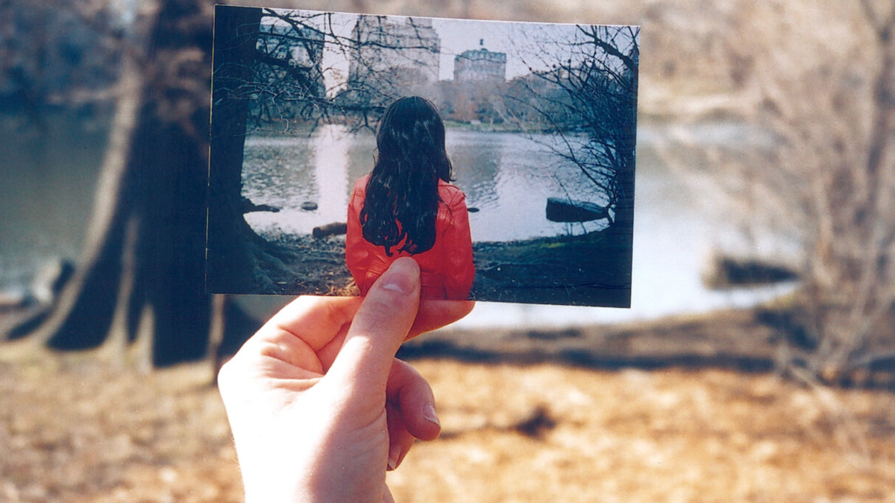
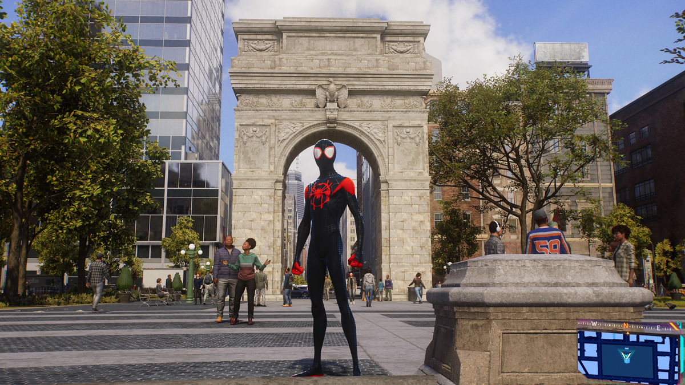
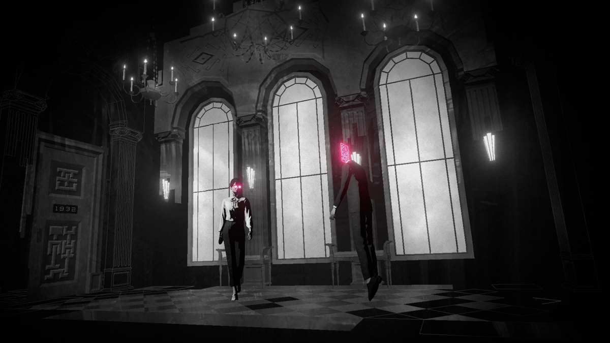
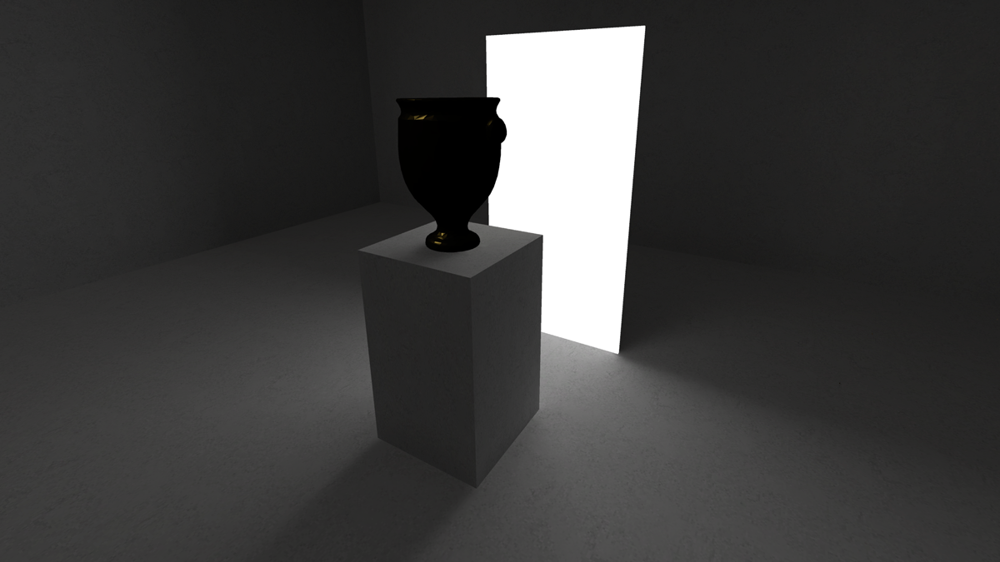

# Question 3

_What are the current and historical approaches to the use of sound in the context of contemplation, with a particular focus on games? Please outline your process and results with respect to research-recreation responses to this subject area._

## Contemplation Aesthetics

Book III of Schopenhauer's "The World as Will and Representation" holds some interesting language about what he calls "aesthetic contemplation," which I feel may be pertinent to the ideas that I seek to explore. In section 34 he describes the shift from looking at something through "reason" to "a steady contemplation" by saying:

_if, instead of all this, we devote the entire power of our mind to intuition and immerse ourselves in this entirely, letting the whole of consciousness be filled with peaceful contemplation of the natural object that is directly present, a landscape, a tree, a cliff, a building, or whatever it might be, and, according to a suggestive figure of speech, we *lose* ourselves in this object completely, i.e we forget our individuality, our will, and continue to exist only as pure subject, the clear mirror of the object_

Schopenhauer argues that this shift helps to being the viewer closer to the "Idea" rather than the object, echoing Plato's notion of an ideal form. While we don't necessarily need to carry over this idea of an idealized form (or spiritual/essential perfection) this concept of aesthetic contemplation is helpful in discussing the type of experience that one could have with the built world, an experience that moves from the surface to something deeper. What is especially helpful is the way that Schopenhauer includes space for *active* contemplation on the part of the viewer. It is not a passive, peaceful, zen calm, but rather an attitude of looking that is searching for more. Some philosophers and art historians have coined the term ["aesthetic attitude"](https://iep.utm.edu/aesthetic-attitude/) to explain this idea. 

Is it possible, then, for us to think about the foundational elements of certain objects as the gateways from which a reflective/contemplative experience might stem? For example, is the contemplative nature of architecture embedded in the way that light hits certain colors? Or how light and sound reverberate together in a particular room? With a particular shape? And of a particular material? If this is the case, what are the material elements of other media that can be examples of contemplative art? Light and hue for painting. Timbre, frequency, and reverberation for audio. 

Aesthetic attitude / Aesthetics of digital interactive art

Taking this to the next logical step, is it better for us as designers to engage with the materiality of games, the things that make games games, rather than mimicking those aspects of contemplative experiences that we can only recreate digitally? Specifically, I think of the digital recreation of light or the physical world. And this is not to say that the light emanating from a screen isn't worthy of reflection. It is mainly that we seem to treat as one to one to other types of light. It is interesting to note that rather than approach the inherently thingy-ness of digital technology, we continue to rely on metaphors and ideas borrowed from existing areas of life. What are the things of digital technology or of games (the stuff games are made of) that we can build these contemplative experiences out of.

As an exploration, below are three possible aesthetic materials of games that can be used for lenses/methods/areas of contemplative engagement. Though I am looking at these aspects from the specific point of view of games, much can be learned by how these materials are considered by practitioners in other contemplative artforms. All of is then applied to the designing of exploratory experiments to see how a contemplative state in games could be designed for.

## Aesthetics for Contemplative Audio Games

### Soundwalks

#### Westerkamp

One field of practice that can greatly inform this concept of contemplative games is Soundwalking. Soundwalking started as part of R. Murray Schafer's *World Soundscape Project*, which arose out of active listening practices being developed by artists like John Cage and Pauline Oliveras. Schafer and those in the project sought to anchor these active listening practices to a given place. Hildegard Westerkamp especially believed that through soundwalking, listeners could better understand their sonic environments. 

_A soundwalk is any excursion whose main purpose is listening to the environment. It is exposing our ears to every sound around us no matter where we are. We may be at home, we may be walking across a downtown street, through a park, along the beach; we may be sitting in a doctor's office, in a hotel lobby, in a bank; we may be shopping in a supermarket, a department store, or a Chinese grocery store; we may be standing at the airport, the train station, the bus-stop. Wherever we go we will give our ears priority. They have been neglected by us for a long time and, as a result, we have done little to develop an acoustic environment of good quality._[^2]

Additionally, Westerkamp recorded soundwalks so that those who could not actually visit a given location could experience it remotely. Westerkamp then broadcasted these recordings on her radio program on Vancouver Co-op Radio, sometimes commenting o what the listener was hearing. These guided soundwalks were a way to point out to the listener things that they otherwise might have missed.

#### Experiments S.1 & S.2

In response to this Westerkampian style of Soundwalk, I created a series of recorded audio essays over videogame footage. In these experiments, I pointed out sonic elements from the game, directing the listener's attention to how these worked in the game and maybe giving technological background for how these sounds might function on a sound design level. 

_What does it even mean to listen to our games? There is sound there, to be sure, but do we pay attention to it? What do you hear right now as you play? What time of day is it, and how are the sounds communicating that to you? Are you in a bustling part of the financial district at mid-morning with citizens congratulating you on your most recent exploits? Are you in a more isolated part of the city in the late evening? Maybe Central Park with small scurrying animals and the wind whistling through the trees._[^3]

One revelation from this process is realizing how the material edges blur when we are talking about "soundwalking" in games. In the physical world we are pointing to real sonic phenomena out in the world, whether that is from natural or manmade sources (the way the wind whistles through a tree's leaves, the sound that a bridge makes when you rap it with your fists). But in games, we are expounding upon the sonic qualities of digitally replicated sounds, sounds which have been designed a certain way and added to the space for a given reason. In this way, we can argue that one of the underlying "natural" aspects of this sonic environment is its technology. Thinking about this technology (and the associated design, social, and economic systems around it) as a material aspect of the soundscape opens up some interesting possibilities for future consideration.
#### Janet Cardiff and George Bures Miller

The Soundwalks of Janet Cardiff and George Bures Miller differ from Westerkamp's in a few ways. While are similar to Westerkamps in-person guided listening walks in that they take place in a given sonic environment that the listener is currently in, neither Cardiff or Miller are actually present. Instead, the listener is guided by Cardiff's pre-recorded voice via headphones. Cardiff/Miller leverage this recorded to technology to then overlay audio in exploratory and exciting ways. Snippets of conversation slip by that feel like that are in the same space as you. Cardiff speaks directly to you, but then has conversation with others who are not visibly present. Recorded audio effects of things like long gone marching bands, sirens, and political rallies make the listener feel as if they are experiencing a highly professional radio drama. 

From Cardiff/Miller, I identified six strategies for creating deep experiences with soundwalks.

- *Synchronization* - Creating a sense of rhythm and focus by asking the participant to align physical actions to the audio (breathing, walking, looking)
- *Frame-Shifting* - Indirectly encouraging active listening by juxtaposing and overlaying incongruous and/or complex sounds
- *Parallel Realities* - Layering 3D sounds and effects that blur the listener’s perception of recorded and live space
- *Alternative Scoring* - Overlaying musical combinations on an existing space
- *Historical Narratives* - Presenting stories and other history-telling forms relating to the current space inhabited by the listener
- *Personal Narratives* - Incorporating personal speech from a narrator,  including environmental sounds local to the narrator, often set in the same space the listener is in

#### Experiments S.3-S.9

Taking inspiration from Cardiff/Miller and their soundwalks, I created a series of soundwalks that each focused on one of the strategies listed above. This exploration led to the publication of the paper [Experiments in Soundwalks for Video Games](https://www.cmmas.com/en/ideassonicas32/ideassonicas%2Fsonicideas-23) for the 23rd issue of [Sonic Ideas](https://www.cmmas.com/en/sonicideas).

One of the main take-aways from working on this series of experiments is how the medium of video game is a compelling space for thinking about what it means to be in the same space. If you and I are both playing _Spiderman 2_ we are clearly both in a fictional version of New York City, but there is also the possibility that I am in your living room/bedroom and you are in mine. Do the sounds of my controller, my children, and my physical space bleed into yours? Does this widen the soundscape into more complicated territory? 

### Ambient Interactive Experiences

Another collection of works that I considered as a reference point for contemplative sound games is what I initially called "slow games" but am now referring to as "ambient interactive experiences." The field of slow games is compelling and a clear precedent (with Liam Gibbons thesis “Strategies for the Design of Reflective Shortform Videogames” from 2020 being especially instructive as I work on these ideas), but thinking about ambient media opens up the opportunity to include a lot more material.[^4] These projects all appear to be interested in slow pacing, obfuscation, and less "comfortable" experiences, with varying degrees of success.

#### Luke Jaaniste

Luke Jaaniste's thesis "Approaching the Ambient: Creative Practice and the Ambient Mode of Being" from 2007 seems like a good place to start when defining what we mean by ambient experiences. Interestingly enough, Jaaniste's proposal of the "ambient mode" is actually a bit counter to what we might think of as an ambient experience:

_The ambient mode involves engaging with our surroundings as an ambient pervasive all-around field, without anything being prioritised into foreground and background. Without the salience of the foreground, what would need to become salient is the pervasive ambience itself._

This is in opposition, in particular, to Brian Eno's concept of the ambient as being something that can move from foreground to background in the mindful attention of the audience. Eno's concept is more aligned with the use of gestalt theory in traditional visual design fields.

#### David Oreilly

David Oreilly's two pieces [Mountain](https://store.steampowered.com/app/313340/Mountain/) and [Everything](https://store.steampowered.com/app/582270/Everything/) are great examples of this difference between pervasive ambient experiences versus the Eno-ish mode that Jaaniste refers to as the ambivalent (back-and-forth) mode. In Mountain, almost nothing is required of the player. They need to set the simulation in motion, but after that has happened there is not much for the to do. Rotate the mountain. Zoom in. Zoom out. The mountain sits there and mountains. The user can reflect on the mountain or tune it out while focusing on other things in their life. In contrast, Everything requires more of the player, asking that they work their way through the staggering number of 3D models that Oreilly has created. Oreilly included an auto-play mode, but even with this it still seems to portray a much more focused "pervasive" ambience.
#### ABZU

On the surface, the 2016 game ABZU appears to be a perfect example of an ambient game. The player swims freely in deep ocean waters while rich orchestral music plays. However it is in opposition to all of the ideas from Rilla Khaled's "Questions Over Answers: Reflective Game Design."

- The simple puzzles have single answers -- though perhaps the narrative raises questions (Answers OVER Questions)
- It seems to focus on more of a stealth method of infusing values (Stealth OVER Clarity)
- The whole thing is a comfortable experience (Comfort OVER Disruption)
- It is very immersive (Immersion OVER Reflection)

#### Lorelei and the Laser Eyes

In contrast to ABZU, Simogo's [Lorelei and the Laser Eyes](https://simogo.com/work/loreleiandthelasereyes/) feels like a much more traditional puzzle game, but a lot of the narrative content is intentionally ambiguous, possibly leading to more reflective experiences. The game isn't inherently ambient at all, but some of the difficult puzzles mean that the player might be living with the game in the background of their mind for the days or weeks in which they are playing the game. They might be focused o something at work, and then suddenly a possible solution to a puzzle that previously stumped them can float to the forefront of their mind. Additionally, it's interesting to think here about the place of puzzles as potential roadblocks. If these puzzles create disruption, *can* they lead to reflection? And if they do, is it the right kind of "reflection?"

#### v r 5

Pippin Barr's [v r 5](https://pippinbarr.com/v-r-5/info/) might be the most successful ambient game experience that I looked at because it is trying (at least in part) to recreate a type of museum-going experience, which is inherently experiential. As a viewer approaches an artwork they are invited to bring it to the foreground, but that memory of the artwork pervades and informs future observations. Additionally, standing in front of an artwork, the viewer can stay in that space, that specific pervasive ambience, for as long as is desired. Most games don't afford this. Those that include cinematic cut-scene experiences allow for the player to skip them. It would be almost forbidden to ask a player to sit still and experience a thing without letting them pound on the buttons. 

#### Experiment R.1

In response to these ambient games, I set out to create contemplative game experiences that built on their ideas of pervasive ambience.

This first experiment ([R1](https://mouseandthebillionaire.com/reflectiveStudies/01/)) explored simple constant interaction from the user. When they hover over the black circle it begins to slowly grow in size while the audio detunes and becomes more complex.

One interesting thing about this is that the act of holding the mouse over the circle becomes easier and easier and easier as the circle grows larger (until really the user doesn't need to do anything for it to continue). This feels in line with reflective or meditative experiences. It's often harder to get going, to decide to take time away from your thoughts or activities but then once you're going it's much easier to keep going. There's just enough effort required of you from the start, and it is satisfying as those requirements become less and less.

#### Experiment R.2

This second iteration ([R2](https://mouseandthebillionaire.com/reflectiveStudies/02/)) is functionally the same as R1 but inverts the colors and has the music progressing from distortion to clean, thus creating a bit more thematically aligned experience.

#### Experiment R.3

In this experiment ([R3](https://mouseandthebillionaire.com/reflectiveStudies/03/))the user is presented with a randomized looping pattern of airy piano notes against a droning background. They can use WASD to "wander" which randomizes the notes and creates a flurry of radio static and jittering notes. Once they stop a new pattern emerges, and they can choose to sit with it for as long as they desire, or continue wandering in search of something new. The goal of this experiment is to see what is available when thinking about trying to push the player toward innactivity. Is it possible to make an engaging experience when you are asking the player *not* to play?

#### Experiment R.3.5

[Experiment R.3.5](https://mouseandthebillionaire.com/reflectiveStudies/03/dontSnake.html) took the ideas from R3 and applies it to the game Snake. If the player tries to use the keyboard to move their snake they are barraged by a chaos of notes and shapes. Adding this playable layer on top of the previous experiment creates a tension between wanting to act (snake) and not. And by deciding to let the snake wrap around the sides, it becomes possible for the player to really stop playing and pay attention to the sonic patterns created as their snake slowly and repeatedly traverses the playing field.

## Elements, Precedents, and Experiments
- Magic Circle / Soundwalks
- Time / Slow Games
- Space & Movement / Aesthetic Architecture
- Rules? / the Rule of St Benedict? 
- Agency??

Side note: I am realizing that all of these could possibly be framed with Soundwalks as the connecting tissue, in which case the format might be more of:
- element A is in games
- here is how that is handled in Soundwalks
- here is how it is handled in other disciplines
- here is a series of experiments I made in reaction to this

[^2]: **Westerkamp, “Soundwalking,” [https://www.hildegardwesterkamp.ca/writings/writingsby/?post_id=13&title=soundwalking](https://www.hildegardwesterkamp.ca/writings/writingsby/?post_id=13&title=soundwalking)**
[^3]: Bethancourt, guided soundwalk for Firewatch and Red Dead Redemption 2
[^4]: In particular, the possibility to think about Eno's ambient work (obviously) and also Paul Roquet's [Ambient Media](https://www.upress.umn.edu/9780816692460/ambient-media/), which I haven't referenced at all in this study but think about a great deal

